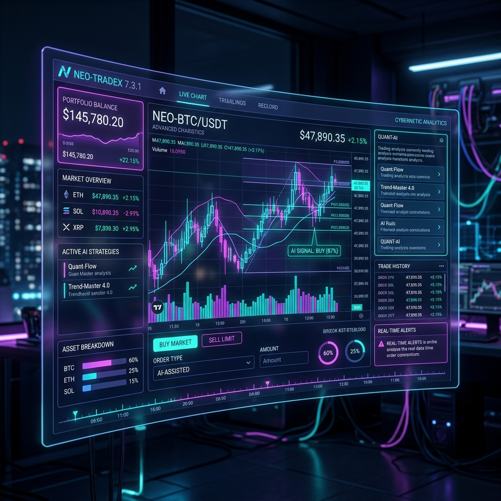

<div align="center">
  
  <!-- Main Banner -->
  
  
  <h1>🤖 Mantle AI Trader</h1>
  
  <h3>AI-Powered Cryptocurrency Trading Bot with News Sentiment Analysis</h3>
  
  <p>
    <strong>Free Open Source Trading Bot</strong> • 
    <strong>Bybit Integration</strong> • 
    <strong>Real-time Signals</strong> • 
    <strong>Backtesting Engine</strong>
  </p>
  
  <!-- Badges -->
  <p>
    <a href="https://github.com/roman-ryzenadvanced/mantle-ai-trader/blob/main/LICENSE">
      
    </a>
    
    
    
    
  </p>
  
  <p>
    
    
    
    
    
    
  </p>
  
  <p><em>🏆 Built for <strong>Mantle Turing Test Hackathon</strong> - $120,000 Prize Pool</em></p>
  
  <!-- Made by Badge -->
  <a href="https://rommark.dev" target="_blank">
    
  </a>
  
</div>

---

## 📋 Table of Contents

- [⚠️ Risk Disclaimer](#️-risk-disclaimer)
- [Features](#-features)
- [Demo](#-demo)
- [Quick Start](#-quick-start)
- [Installation](#-installation)
- [Usage](#-usage)
- [API Reference](#-api-reference)
- [Configuration](#-configuration)
- [Architecture](#-architecture)
- [Testing](#-testing)
- [Contributing](#-contributing)
- [License](#-license)

---

## ⚠️ Risk Disclaimer

> **🚨 CRITICAL WARNING - READ BEFORE USE 🚨**
>
> **This software is for EDUCATIONAL and DEMONSTRATION purposes ONLY.**
>
> - **TRADING INVOLVES SUBSTANTIAL RISK**: You could lose ALL your investment.
> - **NO GUARANTEE OF PROFITS**: Past performance does NOT guarantee future results.
> - **NOT FINANCIAL ADVICE**: AI signals are algorithmic suggestions, NOT professional advice.
> - **USE AT YOUR OWN RISK**: The creators are NOT responsible for any financial losses.
> - **PAPER TRADING RECOMMENDED**: Always test with demo mode before any live trading.
> - **NEVER TRADE WITH MONEY YOU CANNOT AFFORD TO LOSE**.
>
> 📖 **Read the full [DISCLAIMER.md](./DISCLAIMER.md) before using this software.**

---

## 🚀 Features

### 🤖 AI-Powered Trading Signals
| Feature | Description |
|---------|-------------|
| **Signal Generation** | AI-generated buy/sell signals with confidence scores |
| **Technical Analysis** | RSI, MACD, SMA, EMA, Bollinger Bands, VWAP, ADX, Volume Profile, Ichimoku Cloud, Stochastic Oscillator (%K/%D) |
| **Pattern Recognition** | Doji, Hammer, Engulfing, Morning Star, Evening Star, Inverted Hammer |
| **Support/Resistance** | Automated level detection |
| **Multi-Indicator Confirmation** | 10+ indicators cross-validated for signal quality |

### 🛡️ Risk Management
| Feature | Description |
|---------|-------------|
| **Position Sizing** | Kelly Criterion-influenced fixed-fractional sizing |
| **Drawdown Protection** | Auto-halt trading at configurable drawdown threshold |
| **Daily Loss Limit** | Stop trading when daily loss exceeds threshold |
| **Portfolio Risk Scoring** | 0-1 scale combining position risk + concentration |
| **Margin Call Detection** | Automatic liquidation of worst positions first |
| **Emergency Halt** | One-click trading halt with configurable thresholds |
| **Circuit Breaker** | Auto-halt after consecutive losses with gradual recovery (NEW v3.1.0) |

### 📰 Fundamental News Analysis
- **Multi-Source Aggregation**: CryptoPanic, CoinGecko, CryptoCompare
- **Sentiment Scoring**: Bullish/Bearish classification (-1 to 1)
- **Real-time Updates**: Live news feed integration
- **Impact Assessment**: News importance scoring

### 📊 Backtesting Engine
- **Historical Simulation**: Test strategies on past data
- **Performance Metrics**: Sharpe Ratio, Win Rate, Max Drawdown
- **Strategy Optimization**: Parameter grid search
- **Detailed Reports**: Trade-by-trade analysis

### 💰 Paper Trading (Demo Mode)
- **Risk-Free Testing**: Practice without real money
- **Real Market Prices**: Live price simulation
- **Portfolio Tracking**: P&L monitoring
- **Position Management**: Stop-loss/Take-profit

### 📓 Trade Journal (NEW v3.1.0)
- **Trade Recording**: Log entries with entry/exit, PnL, and emotional state
- **Review Reports**: Comprehensive trade review with win/loss analysis
- **Win Rate by Strategy**: Performance breakdown per strategy type

### ⚖️ Portfolio Rebalancer (NEW v3.1.0)
- **Target Allocations**: Define and manage target portfolio weights
- **Drift Detection**: Automatic detection when allocations deviate from targets
- **Risk-Adjusted Allocation**: Position sizing adjusted by risk profile

### 🏥 Health Check API (NEW v3.1.0)
- **System Status Monitoring**: Real-time health check endpoint for service status

### 🔗 Exchange Integration
- **Bybit API**: Full spot and futures support
- **Testnet Mode**: Safe testing environment
- **Order Types**: Market, Limit, Stop orders
- **Position Management**: Leverage, margin, risk controls

---

## 🎬 Demo

<details>
<summary>📷 View Screenshots</summary>

### Dashboard Overview


### Signal Generation


### Paper Trading


</details>

---

## ⚡ Quick Start

```bash
# Clone the repository
git clone https://github.com/roman-ryzenadvanced/mantle-ai-trader.git
cd mantle-ai-trader

# Install dependencies
bun install

# Setup database
bun run db:push

# Start the application
bun run dev
```

Open [http://localhost:3000](http://localhost:3000) to access the dashboard.

---

## 🛠 Installation

### Prerequisites

| Requirement | Version | Notes |
|------------|---------|-------|
| Node.js | 18+ | or Bun runtime |
| SQLite | Included | Default database |
| Bybit API | Optional | For live trading |

### Step-by-Step Setup

```bash
# 1. Clone repository
git clone https://github.com/roman-ryzenadvanced/mantle-ai-trader.git

# 2. Navigate to project
cd mantle-ai-trader

# 3. Install dependencies
bun install

# 4. Configure environment
cp .env.example .env
# Edit .env with your API keys (optional)

# 5. Initialize database
bun run db:push

# 6. Start development server
bun run dev

# 7. (Optional) Start WebSocket service
bun run trading-service
```

### Docker Installation (Coming Soon)

```bash
docker-compose up -d
```

---

## 📈 Usage

### Web Dashboard

| Tab | Function |
|-----|----------|
| **Signals** | Generate and view AI trading signals |
| **Positions** | Manage open positions and portfolio |
| **Backtest** | Run strategy simulations |
| **News** | View market news with sentiment |

### Supported Trading Pairs

- BTCUSDT, ETHUSDT, SOLUSDT, BNBUSDT, XRPUSDT
- And 100+ more via Bybit API

### Signal Example

```json
{
  "symbol": "BTCUSDT",
  "action": "BUY",
  "confidence": 0.85,
  "reasoning": "Bullish trend with strong support at $44,000. RSI oversold recovery.",
  "stopLoss": 43500,
  "takeProfit": 46500,
  "technicalScore": 0.78,
  "sentimentScore": 0.65
}
```

---

## 🔌 API Reference

### Base URL
```
http://localhost:3000/api/trading
```

### Endpoints

#### Generate Signal
```http
POST /signals
Content-Type: application/json

{
  "symbol": "BTCUSDT",
  "timeframe": "1h"
}
```

#### Get Portfolio
```http
GET /demo?action=portfolio
```

#### Place Demo Order
```http
POST /demo
Content-Type: application/json

{
  "action": "place_order",
  "symbol": "BTCUSDT",
  "side": "BUY",
  "quantity": 0.01,
  "type": "MARKET"
}
```

#### Run Backtest
```http
POST /backtest
Content-Type: application/json

{
  "symbol": "BTCUSDT",
  "startDate": "2024-01-01",
  "endDate": "2024-06-01",
  "initialCapital": 10000
}
```

#### Get News
```http
GET /news?symbol=BTC&limit=20
```

---

## 🔧 Configuration

### Environment Variables

```env
# Bybit Exchange (Optional)
BYBIT_API_KEY=your_api_key
BYBIT_API_SECRET=your_api_secret
BYBIT_TESTNET=true

# News APIs (Optional)
CRYPTOPANIC_API_KEY=your_key
CRYPTOCOMPARE_API_KEY=your_key

# Vector Database (Optional)
CHROMADB_URL=http://localhost:8000

# Database
DATABASE_URL="file:./prisma/data/mantle-trader.db"
```

### Risk Management Settings

| Setting | Default | Description |
|---------|---------|-------------|
| Risk Level | MODERATE | CONSERVATIVE, MODERATE, AGGRESSIVE |
| Max Position | $1,000 | Maximum position size |
| Max Leverage | 5x | Maximum leverage multiplier |
| Auto Trading | Disabled | Automatic signal execution |

---

## 📊 Architecture

```
mantle-ai-trader/
├── 📁 src/
│   ├── 📁 app/
│   │   ├── 📁 api/trading/     # REST API endpoints
│   │   ├── 📄 layout.tsx       # Root layout with SEO
│   │   └── 📄 page.tsx         # Main dashboard
│   ├── 📁 lib/
│   │   ├── 📁 trading/
│   │   │   ├── 📁 core/        # Types & Bybit client
│   │   │   ├── 📁 signals/     # AI signal engine + 12+ indicators
│   │   │   ├── 📁 news/        # News aggregator
│   │   │   ├── 📁 backtest/    # Backtesting
│   │   │   ├── 📁 demo/        # Paper trading + trailing stops
│   │   │   ├── 📁 risk/        # Risk management system
│   │   │   ├── 📁 analytics/   # Performance tracking
│   │   │   ├── 📁 journal/     # Trade journal system
│   │   │   └── 📁 portfolio/   # Portfolio rebalancer
│   │   ├── 📁 api/             # API validation utilities
│   │   └── 📁 vector/          # VectorDB
│   └── 📁 components/ui/       # UI components
├── 📁 tests/                   # 620+ tests across 22 files
│   ├── 📁 unit/                # 16 unit test files
│   ├── 📁 integration/         # 3 integration test files
│   ├── 📁 e2e/                 # 2 E2E test files
│   └── 📁 stress/              # 1 stress test file
├── 📁 mini-services/
│   └── 📁 trading-service/     # WebSocket service
├── 📁 prisma/
│   └── 📄 schema.prisma        # Database schema
└── 📁 public/                  # Static assets
```

### Tech Stack

| Category | Technology |
|----------|------------|
| **Framework** | Next.js 16, TypeScript 5 |
| **Styling** | Tailwind CSS 4, shadcn/ui |
| **Database** | Prisma ORM, SQLite |
| **AI/ML** | z-ai-web-dev-sdk |
| **Exchange** | Bybit API v5 |
| **Real-time** | Socket.io |
| **Charts** | Recharts |
| **State** | Zustand, TanStack Query |

---

## 🧪 Testing

```bash
# Run all tests
bun test

# Run unit tests only
bun test tests/unit/

# Run integration tests
bun test tests/integration/

# Run E2E tests
bun test tests/e2e/
```

### Test Coverage (v3.1.0)

| Module | Tests | Status |
|--------|-------|--------|
| Core Types | 8 | ✅ All pass |
| Signal Engine | 18 | ✅ All pass |
| Technical Indicators | 61 | ✅ All pass |
| Ichimoku Cloud | 16 | ✅ All pass |
| Stochastic Oscillator | 21 | ✅ All pass |
| Demo Trader | 35 | ✅ All pass |
| News Aggregator | 14 | ✅ All pass |
| Vector Store | 5 | ✅ All pass |
| Backtest Engine | 6 | ✅ All pass |
| Risk Manager | 52 | ✅ All pass |
| Circuit Breaker | 30 | ✅ All pass |
| Performance Tracker | 47 | ✅ All pass |
| Bybit Client | 53 | ✅ All pass |
| API Validation | 71 | ✅ All pass |
| API Integration | 8 | ✅ All pass |
| Signal Pipeline | 26 | ✅ All pass |
| Risk Integration | 20 | ✅ All pass |
| Trade Journal | 30 | ✅ All pass |
| Portfolio Rebalancer | 28 | ✅ All pass |
| E2E Workflows | 10 | ✅ All pass |
| Stress Tests | 15 | ✅ All pass |
| **Total** | **620+** | **✅ All pass** |

---

## 📋 Version History

| Version | Date | Highlights |
|---------|------|------------|
| **v3.1.0** | 2026-06-06 | Circuit Breaker, Ichimoku Cloud, Stochastic Oscillator, Trade Journal, Portfolio Rebalancer, Health Check API, 620+ tests |
| **v3.0.0** | 2026-06-06 | Risk Management, Performance Analytics, Bollinger Bands, VWAP, ADX, Volume Profile, 447 tests |
| **v2.0.0** | 2026-06-06 | 8 critical bug fixes, sentiment/MACD/RSI fixes, comprehensive test suite |
| **v1.0.0** | 2025-06-06 | Initial release with core trading engine |

## 🤝 Contributing

Contributions are welcome! Please follow these steps:

1. 🍴 Fork the repository
2. 🌿 Create a feature branch (`git checkout -b feature/amazing-feature`)
3. 💾 Commit your changes (`git commit -m 'Add amazing feature'`)
4. 📤 Push to the branch (`git push origin feature/amazing-feature`)
5. 🔃 Open a Pull Request

### Code of Conduct
- Be respectful and inclusive
- Write clean, documented code
- Add tests for new features
- Update documentation

---

## 📜 License

This project is licensed under the **MIT License** - see the [LICENSE](LICENSE) file for details.

```
MIT License - Free to use, modify, and distribute
```

---

## 🏆 Mantle Turing Test Hackathon

This project is built for the **Mantle Turing Test Hackathon**:

| Info | Details |
|------|---------|
| **Prize Pool** | $120,000 cash + $103,000 API credits |
| **Tracks** | AI Trading, AI Alpha & Data |
| **Registration** | [mantle.to/Hackathon](https://mantle.to/Hackathon) |
| **Chat** | [Telegram](https://t.me/MantleTuringTestHackathon) |

### Competition Tracks
- ✅ **AI Trading** - Trading bots, strategy automation, Bybit API
- ✅ **AI Alpha & Data** - Onchain analytics, anomaly detection

---

## 🏆 Hackathon Submission

### Project Overview
**Mantle AI Trader** is an AI-powered cryptocurrency trading bot built for the Mantle Turing Test Hackathon. It combines 12+ technical indicators, news sentiment analysis, and intelligent risk management into a comprehensive trading platform with 620+ passing tests.

### Key Differentiators
- **🛡️ Circuit Breaker Pattern**: Auto-halts trading after consecutive losses with gradual HALF_OPEN recovery — a production-grade safety net rarely seen in hackathon projects
- **📓 Trade Journal**: Full trade recording, review reports, and win-rate-by-strategy analytics for continuous strategy improvement
- **⚖️ Portfolio Rebalancer**: Target allocation management with drift detection and risk-adjusted position sizing
- **🔬 Battle-Tested**: 620+ tests across 22 files with 9 critical bug fixes documented — we found and fixed bugs that would have caused real financial losses
- **📊 12+ Technical Indicators**: RSI, MACD, Bollinger Bands, VWAP, ADX, Volume Profile, Ichimoku Cloud, Stochastic Oscillator, and more
- **📰 Multi-Source News Sentiment**: Aggregated from CryptoPanic, CoinGecko, and CryptoCompare with real-time scoring

### Technical Highlights
- **TypeScript 5** with strict mode (`noImplicitAny: true`)
- **Next.js 16** full-stack application with REST API + WebSocket
- **Prisma ORM** with SQLite for persistent storage
- **z-ai-web-dev-sdk** for AI-powered signal reasoning
- **Bybit API v5** integration for real exchange connectivity
- **Comprehensive error handling**: Input validation, re-entrancy guards, negative balance protection
- **Security hardening**: API error responses sanitized (no internal details exposed), XSS/SQL injection validation

### Demo Instructions
```bash
# 1. Clone and install
git clone https://github.com/roman-ryzenadvanced/mantle-ai-trader.git
cd mantle-ai-trader
bun install

# 2. Setup database
bun run db:push

# 3. Start the app
bun run dev

# 4. Open dashboard
# http://localhost:3000

# 5. Run the test suite (620+ tests)
bun test

# 6. Health check
curl http://localhost:3000/api/health
```

---

## 🌟 Star History

<a href="https://www.star-history.com/#roman-ryzenadvanced/mantle-ai-trader&Date">
 <picture>
   <source media="(prefers-color-scheme: dark)" srcset="https://api.star-history.com/svg?repos=roman-ryzenadvanced/mantle-ai-trader&type=Date&theme=dark" />
   <source media="(prefers-color-scheme: light)" srcset="https://api.star-history.com/svg?repos=roman-ryzenadvanced/mantle-ai-trader&type=Date" />
   
 </picture>
</a>

---

## 📞 Support & Community

| Platform | Link |
|----------|------|
| **GitHub Issues** | [Report a Bug](https://github.com/roman-ryzenadvanced/mantle-ai-trader/issues) |
| **Discussions** | [GitHub Discussions](https://github.com/roman-ryzenadvanced/mantle-ai-trader/discussions) |
| **Telegram** | [Mantle Hackathon Chat](https://t.me/MantleTuringTestHackathon) |
| **Twitter** | [@rommarkdev](https://twitter.com/rommarkdev) |

---

<div align="center">
  
  <!-- Made by Rommark.Dev Banner -->
  <a href="https://rommark.dev" target="_blank">
    
  </a>
  
  <br /><br />
  
  <p>
    <a href="https://github.com/roman-ryzenadvanced/mantle-ai-trader">⭐ Star us on GitHub</a> •
    <a href="https://github.com/roman-ryzenadvanced/mantle-ai-trader/issues">🐛 Report Bug</a> •
    <a href="https://github.com/roman-ryzenadvanced/mantle-ai-trader/pulls">💡 Request Feature</a>
  </p>
  
  <p><strong>Keywords:</strong> AI trading bot, cryptocurrency trading, crypto signals, Bybit API, trading automation, sentiment analysis, backtesting, paper trading, Mantle hackathon, open source trading bot, TypeScript, Next.js, algorithmic trading, DeFi, Web3</p>
  
</div>
